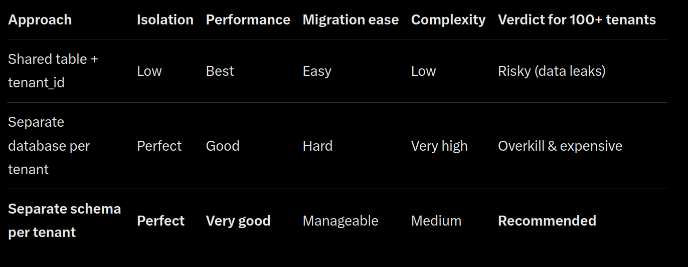

<!-->
API Server for Company Registry

- Steps for Implementation
    - Create Postgres DB
        - Done
    - Create Tables
        - Done
    - Insert Values in DB
        - [curl command](../docs/database-upgrade/curl_commands.md)
    - Create fastpi server
        - Done
    - Connect fastapi and postgres Container
        - Done
    - Build ER Cascade / Connection graph

    - Test endpoints for connection graph

    - Test - 
    - Test Migration
    - Run 3 version of migrations

-- 

- Run Server
```bash
docker build -t dwani/ubertax-register -f Dockerfile .

docker compose -f docker-compose.yml up -d
```

-- 
Multi tenant
docker build -t dwani/ubertax-register-multi -f Dockerfile .

docker compose -f multi-tenant-compose.yml up -d


-- 





---

Daily Database snapshots 

Datbase backup before any migration 


Copy production to staging and run migration to test changes 


Use alembic for python or Liquibase for xml based 


Utilise postgres containers and test containers for Database related changes

-----
<!-->


# Company Registry API Server

A FastAPI-based company registry service with PostgreSQL backend, supporting multi-tenancy, entity relationship cascading, and robust database migration workflows.

## Features
- FastAPI REST API
- PostgreSQL with connection/entity relationship graph
- Multi-tenant architecture support
- Alembic-powered database migrations
- Docker & Docker Compose deployment
- Daily database snapshots & pre-migration backups
- Staging migration testing workflow

---

## Architecture Overview

### Single-Tenant Setup
Standard setup with one database instance.

### Multi-Tenant Setup


Supports tenant isolation via:
- Schema-based multi-tenancy (recommended)

---

## Prerequisites
- Docker & Docker Compose
- Python 3.11+ (for local development)
- PostgreSQL 15+

---

## Quick Start

### 1. Single-Tenant (Default)

```bash
# Build image
docker build -t dwani/ubertax-register -f Dockerfile .

# Start services
docker compose -f docker-compose.yml up -d

# Or run both commands together
docker build -t dwani/ubertax-register -f Dockerfile . && \
docker compose -f docker-compose.yml up -d
```

### 2. Multi-Tenant Mode

```bash
docker build -t dwani/ubertax-register-multi -f Dockerfile .

docker compose -f multi-tenant-compose.yml up -d
```

---

## Database Setup & Migrations

### Initial Data Load
After starting containers, populate the database:

```bash
# See all available curl commands for seeding data
cat docs/database-upgrade/curl_commands.md

# Example: Insert initial company records
curl -X POST http://localhost:8000/api/v1/seed/companies -H "Content-Type: application/json" -d @docs/database-upgrade/sample-data.json
```

### Migrations (Using Alembic)

We use **Alembic** for versioned database migrations.

```bash
# From inside the FastAPI container or local dev environment
alembic revision --autogenerate -m "Description of changes"
alembic upgrade head
```

#### Safe Migration Workflow (Recommended for Production)

1. **Daily Backup** (Automated via cron or backup tool)
2. **Before any migration** → Create full DB snapshot
3. Copy production → staging environment
4. Run migration on staging first
5. Validate ER graph, endpoints, and data integrity
6. Apply to production only after staging approval

```bash
# Example: Backup before migration
docker exec postgres_container pg_dump -U user company_db > backup_$(date +%Y%m%d_%H%M%S).sql
```

---

## Entity Relationship (ER) Cascade & Connection Graph

### Build & Visualize Connection Graph
The system builds a directed graph representing ownership and control relationships between entities.

### Test Endpoints

```bash
# Get full connection graph
GET /api/v1/graph/connections

# Get entities connected to a specific company
GET /api/v1/graph/connected-entities/{company_id}

# Find ultimate beneficial owners (UBO)
GET /api/v1/graph/ubo/{company_id}

# Detect circular ownership
GET /api/v1/graph/cycles
```

---

## Testing Database Changes

Use **TestContainers** (Python) or disposable PostgreSQL containers for safe testing:

```python
# Example using testcontainers
from testcontainers.postgres import PostgresContainer
import pytest

@pytest.fixture(scope="session")
def postgres():
    pg = PostgresContainer("postgres:15")
    pg.start()
    yield pg
    pg.stop()
```

This ensures zero impact on development or production databases.

---

## Project Structure (Key Files)

```
.
├── app/                    # FastAPI application
├── alembic/                # Migration scripts
├── docs/
│   └── database-upgrade/
│       ├── multi-tenant.png
│       └── curl_commands.md
├── tests/                  # Pytest + Testcontainers
├── Dockerfile
├── docker-compose.yml
├── multi-tenant-compose.yml
└── README.md
```

---

## Best Practices Followed

- Database backups before every migration
- Staging environment mirrors production
- All schema changes via Alembic (never direct SQL in prod)
- Automated tests for ER graph logic
- Tenant isolation in multi-tenant mode
- Comprehensive endpoint testing

---

## Contributing

1. Create feature branch (`feature/ubo-detection`)
2. Make changes + write tests
3. Run full test suite
4. Test migration path on staging clone
5. Submit PR

---

## Support

For issues, reach out to the backend team or create an issue in the repository.

---
