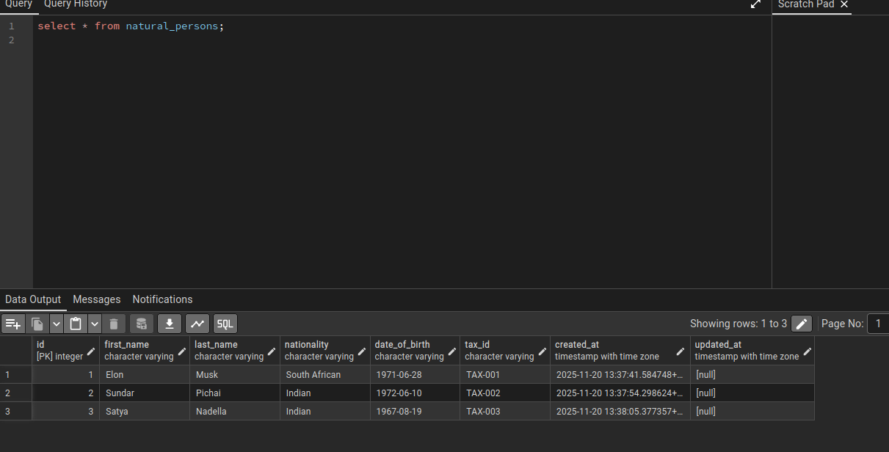
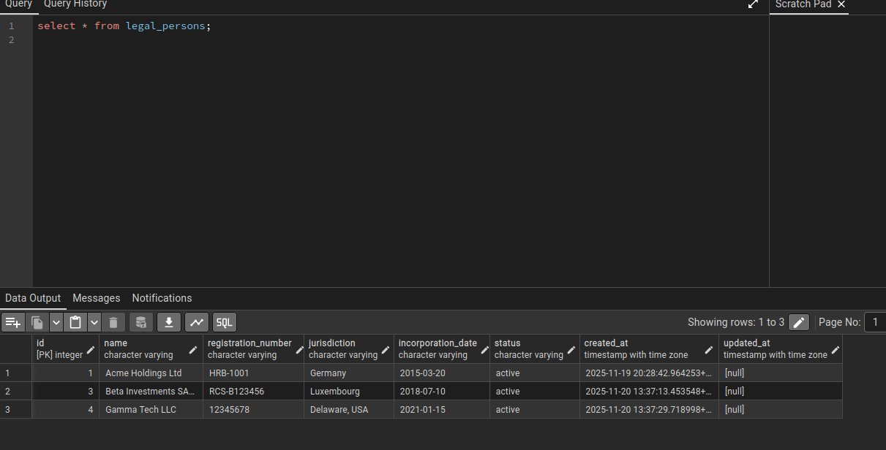

Registry API Server

- Project Requirements - [docs](../docs/database-upgrade/REQUIREMENTS.md)

- Steps undertaken for Implementation
    - Create Postgres DB
        - Done
    - Create Tables
        - Done
    - Insert Values in DB
        - [curl command](../docs/database-upgrade/curl_commands.md)
    - Create fastpi server
        - Done
    - Connect fastapi and postgres Container
        - Done
    - Build ER Cascade / Connection graph
        - Done
    - Test endpoints for connection graph
        - Done

-- 

Run project with Docker
```bash
docker build -t dwani/ubertax-register -f Dockerfile .

docker compose -f docker-compose.yml up -d
```

- Access Postgres via PGAdmin - [docs](../docs/database-upgrade/pg-admin.md)
    

- Natural Persons DB Table 



- Legal Persons DB Table

