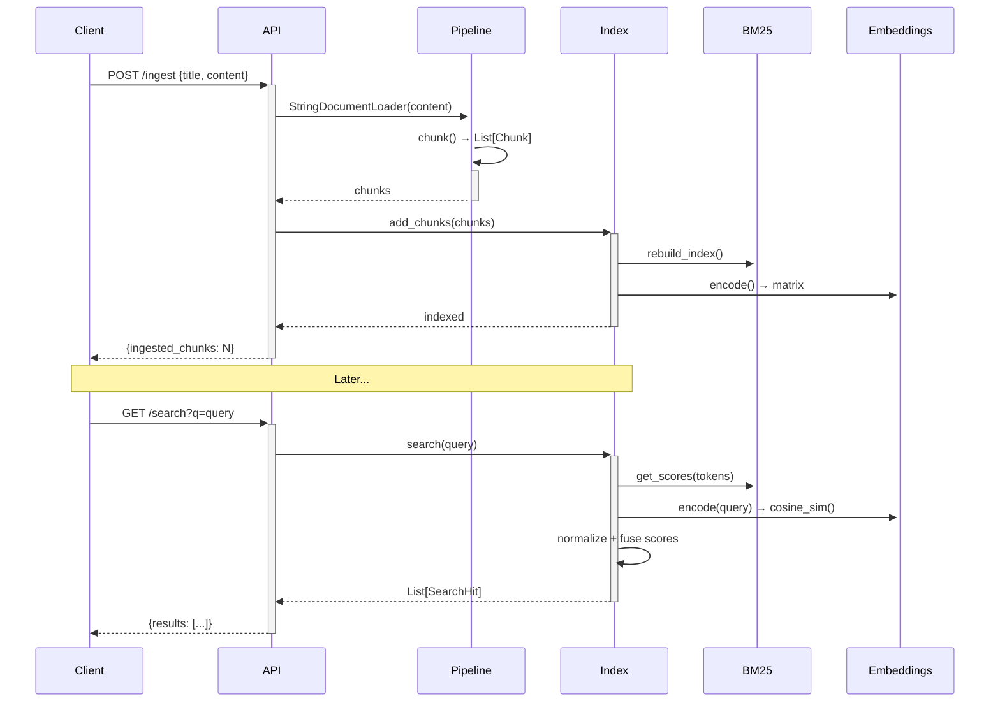

# Nia: Indexing and Retrieval Service Prototype
[
Nia is a hybrid search service that ingests documents from multiple sources, chunks them
intelligently, builds BM25 + semantic indexes, and exposes hybrid search via HTTP API.
Designed for codebases, docs, and technical content.
## Features
- **Multi-format ingestion**: strings, files (txt/md/pdf), directories
- **Pluggable chunking**: paragraph-based, fixed-size sliding window
- **Hybrid search**: BM25 lexical + semantic embeddings (fusion scoring)
- **FastAPI HTTP API**: ingest + search endpoints
- **Production-ready architecture**: modular, testable, extensible

## Architecture Overview
```
┌─────────────────┐ ┌──────────────────┐
┌─────────────────┐
│ HTTP API
│ │ Ingestion
│ │ NiaIndex
│
│ (FastAPI)
│◄──►│ Pipeline
│◄──►│ (Hybrid)
│
│
│ │
│ │
│
│ • /ingest
│ │ • Loaders
│ │ • BM25
│
│ • /search
│ │ • Chunkers
│ │ • Embeddings │
│ • /health
│ │
│ │ • Score Fusion │
└─────────────────┘ └──────────────────┘
└─────────────────┘
```


## Sequence Diagram: Ingest → Search


## Component Diagram
```mermaid
graph TB
subgraph "Ingestion Pipeline"
L1[StringLoader]
L2[FileLoader]
L3[DirectoryLoader]
C1[ParagraphChunker]
C2[FixedSizeChunker]
P[IngestionPipeline]
end
subgraph "NiaIndex (Hybrid)"
CH[Chunks Store]
B[BM25 Index]
E[Embedding Matrix]
F[Fusion Ranker]
end
subgraph "HTTP API"
I[/ingest]
S[/search]
H[/health]
end
L1 --> P
L2 --> P
L3 --> P
C1 -.-> P
C2 -.-> P
P --> CH
CH --> B
CH --> E
B --> F
E --> F
I --> P
S --> F
```

## Data Flow: Document → Search Hit
```mermaid
flowchart TD
A[Raw Content<br/>txt/md/pdf/dir] --> B[Document<br/>id, uri, title, content]
B --> C{Chunker}
C -->|Paragraph| D[Chunk 1<br/>text, position, metadata]
C -->|Fixed| E[Chunk 2<br/>text, position, metadata]
D --> F[NiaIndex.chunks]
E --> F
F --> G[BM25<br/>tokenized corpus]
F --> H[Embeddings<br/>sentence-transformers]
I[Query] --> J[Tokenize + Embed]
J --> K[BM25 scores]
J --> L[Cosine similarity]
K --> M[Normalize + Fuse<br/>α·BM25 + (1-α)·Embed]
L --> M
M --> N[Top-K SearchHit<br/>chunk_id, text, score]
```

## Quick Start
### 1. Install dependencies
```bash
pip install fastapi uvicorn[standard] rank-bm25 sentence-transformers scikit-learn
```
### 2. Run the service
```bash
uvicorn api:app --host 0.0.0.0 --port 8000 --reload
```
### 3. Ingest documents
```bash
curl -X POST "http://localhost:8000/ingest" \
-H "Content-Type: application/json" \
-d '{
"title": "Nia Overview",
"content": "Nia is an indexing service.\n\nIt builds BM25 and semantic indexes over code and
docs."
}'
```
### 4. Search
```bash
curl "http://localhost:8000/search?q=indexing&k=3"
```
**Response:**
```json
{
"query": "indexing",
"results": [
{
"chunk_id": "uuid",
"text": "Nia is an indexing service.",
"score": 0.92,
"metadata": {"uri": "memory://doc", "title": "Nia Overview"}
}
]
}
```

## API Reference
| Endpoint | Method | Description | Parameters |
|----------|--------|-------------|------------|
| `/health` | GET | Liveness check | - |
| `/ingest` | POST | Ingest document | `{title, content, uri?}` |
| `/search` | POST | Hybrid search | `{query, k=5, alpha=0.6}` |
| `/search` | GET | Quick search | `?q=query&k=5` |
## File Structure
```
nia/
├── ingestion_pipeline.py # Loaders + chunkers
├── core_index.py
# BM25 + embeddings + hybrid search
├── api.py
# FastAPI service
├── build_index.py
# Offline index builder (example)
└── README.md
# This file

```
## Production Roadmap
1. **Persistence**: Postgres for metadata + pgvector/Qdrant for embeddings
2. **Ingestion workers**: Celery/Ray for scalable pipeline
3. **Auth**: API keys + tenant isolation
4. **Observability**: Structured logs + Prometheus metrics
5. **MCP server**: Model Context Protocol integration
6. **Symbol index**: Code-aware parsing + reference graph
## Tech Stack
| Component | Library | Purpose |
|-----------|---------|---------|
| Web | FastAPI | HTTP API |
| Lexical | rank-bm25 | BM25 search |
| Semantic | sentence-transformers | Embeddings |
| Chunking | Custom | Paragraph/fixed-size |
## License
MIT - see `LICENSE` file.